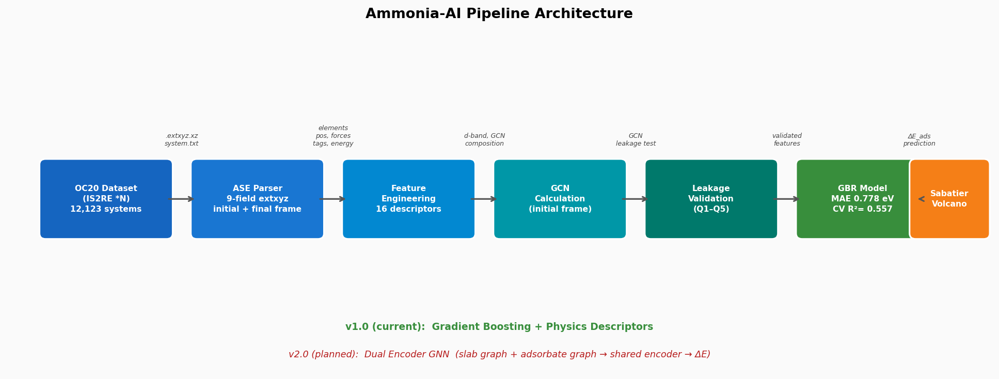
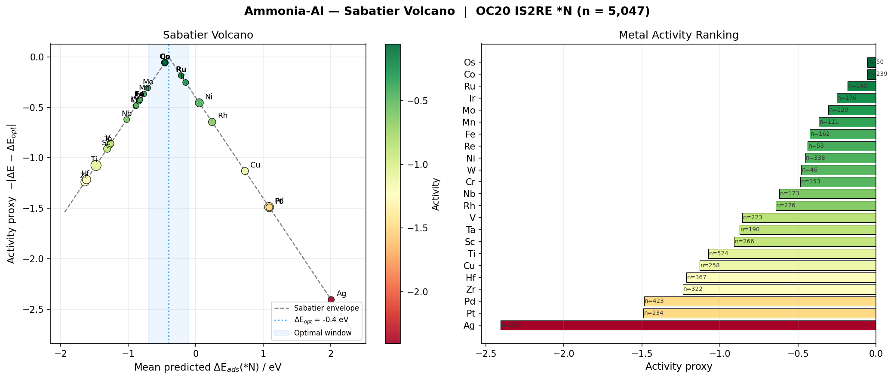
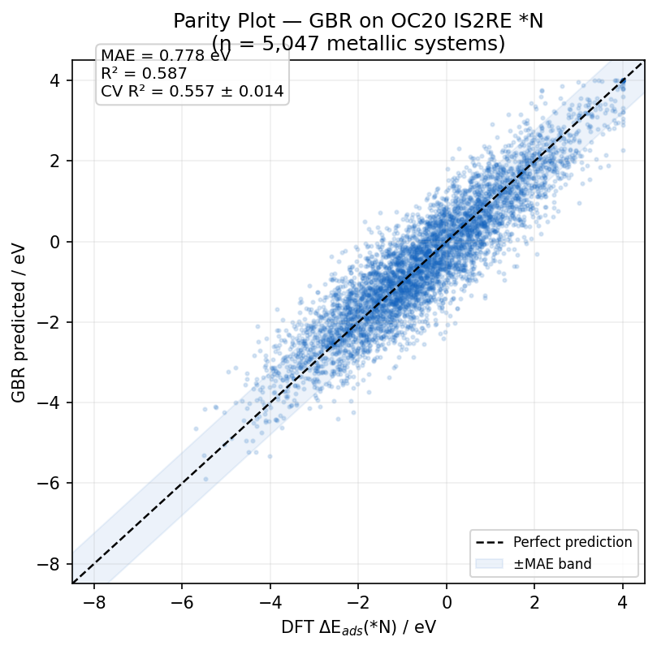
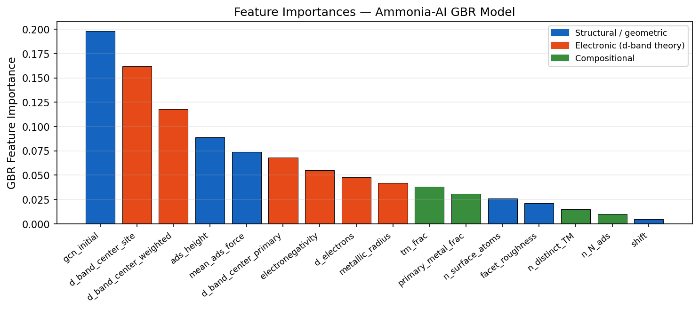

# ammonia-ml-catalyst-discovery

A modular machine learning framework for screening heterogeneous catalysts
for ammonia synthesis, built on the [Open Catalyst 2020 (OC20)](https://opencatalystproject.org/) dataset.

The full Haber-Bosch dissociative mechanism involves multiple adsorbed
intermediates. This repository models each one independently, sharing a
common core library, so results across intermediates can be compared on
the same footing.

---

## The Ammonia Synthesis Mechanism

The dissociative Haber-Bosch pathway on a metal surface proceeds as:

```text
N₂(g)  →  N₂*           molecular adsorption
N₂*    →  2 N*           dissociation  ← rate-limiting on most metals
N*  +  H*  →  NH*        first hydrogenation
NH* +  H*  →  NH₂*       second hydrogenation
NH₂* + H*  →  NH₃*       third hydrogenation
NH₃*   →  NH₃(g)         desorption
```

Each step has its own adsorption energy, its own optimal metal, and its own
Sabatier volcano. This repository models them as separate but linked tasks.

**Why N\* first?** Nitrogen dissociation is the rate-limiting step on the
most active metals (Ru, Fe). The N\* adsorption energy is also the master
descriptor for the full mechanism via linear scaling relations
(Abild-Pedersen et al., *PRL* 2007): ΔE(NH\*) and ΔE(NH₂\*) correlate
linearly with ΔE(N\*) across transition metals (r > 0.98). Modelling N\*
correctly is therefore the highest-impact starting point.

---
## Pipeline Architecture



The framework processes Open Catalyst 2020 (OC20) trajectories by filtering for the target adsorbate, featurizing the initial unrelaxed state, and passing the graph through the core GCN utility to predict the adsorption energy.

---

## Repository Structure

```
ammonia-ml-catalyst-discovery/
│
├── docs/                         Extended documentation and guides
│
├── intermediates/                Reaction intermediate workflows
│   └── n_adsorption/             ✅ Complete (v1.0)
│       ├── figures/
│       │   ├── feature_importance.png
│       │   ├── parity_plot.png
│       │   ├── pipeline_architecture.png
│       │   └── sabatier_volcano.png
│       └── scripts/
│           ├── 01_download_s2ef.py
│           ├── 02_download_is2re_N.py
│           ├── 03_build_and_train.py
│           └── 07_predict_new_catalyst.py
│
├── src/                          Shared core library
│   ├── __init__.py
│   ├── evaluate_gcn.py               GCN feature evaluation (Q1–Q5 diagnostic)
│   ├── gcn_leakage_test.py           Initial vs final frame leakage test
│   └── gcn_utils.py                  GCN calculation (pure math + ASE I/O)
│
├── tests/                        Tests for shared src/ code
│   ├── test_dataset.py
│   ├── test_features.py
│   └── test_gcn.py
│
├── environment.yml               Conda environment definition
├── README.md                     ← this file
└── requirements.txt              Pip dependencies
```

---

## Modules — Current and Planned

| Intermediate | Status | OC20 ads_id | Scientific role |
|---|---|---|---|
| **N\*** | ✅ v1.0 — MAE 0.778 eV, CV R² 0.557 | 77 | Rate-limiting dissociation step; master descriptor for full mechanism |
| N₂\* | 🔜 Planned | 69 | Molecular adsorption; relevant to associative mechanism at low T |
| NH\* | 🔜 Planned | 63 | First hydrogenation; scales linearly with N\* (r = 0.99) |
| NH₂\* | 🔜 Planned | 64 | Second hydrogenation; scales with N\* (r = 0.98) |

The N₂\*, NH\*, and NH₂\* modules will reuse the `src/` library and the
same pipeline scripts with only a change of `--ads-filter` argument.

---

## Shared Core Library (`src/`)

All intermediates share the same feature engineering and GCN utilities.

### `gcn_utils.py`

Two-layer design — pure math separated from file I/O:

```python
from src.gcn_utils import _gcn_from_neighbour_lists  # unit-testable
from src.gcn_utils import calculate_site_gcn          # full pipeline
```

`calculate_site_gcn(path, frame_index=0)` — use `frame_index=0` (initial
unrelaxed frame) for leakage-free screening. This is the operationally
correct choice: when evaluating a new catalyst, only the unrelaxed
structure is available.

---

## Installation

```bash
git clone [https://github.com/Manosir/ammonia-ml-catalyst-discovery.git](https://github.com/Manosir/ammonia-ml-catalyst-discovery.git)
cd ammonia-ml-catalyst-discovery
python -m venv venv && source venv/bin/activate
pip install -r requirements.txt
```

---

## N\* Adsorption — Quickstart

Full framework documentation and methodology papers can be found in the docs/ directory.

```bash
# Download IS2RE *N trajectories (~1.1 GB)
python intermediates/n_adsorption/scripts/02_download_is2re_N.py \
    --out-dir data/is2re_N

# Train: parse → filter → featurize → GBR → volcano (~25 min)
python intermediates/n_adsorption/scripts/03_build_and_train.py \
    --data-dir data/is2re_N/77/77 \
    --gcn-csv  results/gcn_initial_frame.csv \
    --out      results/n_adsorption/
```

### N\* Results



| Metric | Value |
|--------|-------|
| MAE | **0.778 eV** |
| CV R² | **0.557 ± 0.014** |
| n | 5,047 metallic \*N systems |

Ru (ΔE = −0.22 eV) and Co (ΔE = −0.46 eV) are predicted closest to the
Sabatier optimum (ΔE_opt ≈ −0.4 eV), consistent with experimental
ammonia catalyst performance.

### Model Performance



*Parity plot comparing the GCN-predicted N* adsorption energies against the DFT-calculated ground truth from the OC20 dataset.*

### Model Interpretability



*Feature importance breakdown revealing the dominant geometric and electronic descriptors driving the model's energy predictions.*

---

## Running Tests

```bash
pytest -v
```

Tests cover the shared `src/` library and are independent of which
intermediate module is being run.

---

## Roadmap

- **v1.1** — SHAP analysis; improved volcano visualisation; hexagonal density parity plots
- **v1.2** — N₂\* module (molecular adsorption, associative mechanism)
- **v1.3** — NH\* and NH₂\* modules (full dissociative pathway)
- **v2.0** — Dual-Encoder GNN replacing GBR; targeting ~0.1 eV MAE

---

## Citation

If you use this pipeline, please cite:

```bibtex
@software{nosir2026ammoniaai,
  author  = {Nosir, Mohamed},
  title   = {Ammonia-AI: ML-Accelerated Catalyst Screening for Ammonia Synthesis},
  year    = {2026},
  url     = {https://github.com/Manosir/ammonia-ml-catalyst-discovery},
  version = {1.0.0},
  license = {MIT}
}
```

```bibtex
@article{chanussot2021oc20,
  title   = {Open Catalyst 2020 (OC20) Dataset and Community Challenges},
  author  = {Chanussot, Lowik and Das, Abhishek and others},
  journal = {ACS Catalysis},
  year    = {2021},
  doi     = {10.1021/acscatal.0c04525}
}
```

---

## License

MIT — see [LICENSE](LICENSE).

## Author

**Mohamed Nosir** — Computational Materials Scientist  
PhD in Physics of Nanostructures · Postdoctoral Researcher
Computational Chemist | ML Force Fields & Atomistic Simulation for Materials Discovery  
[GitHub](https://github.com/Manosir) · [LinkedIn](https://linkedin.com/in/mohamednosir)
